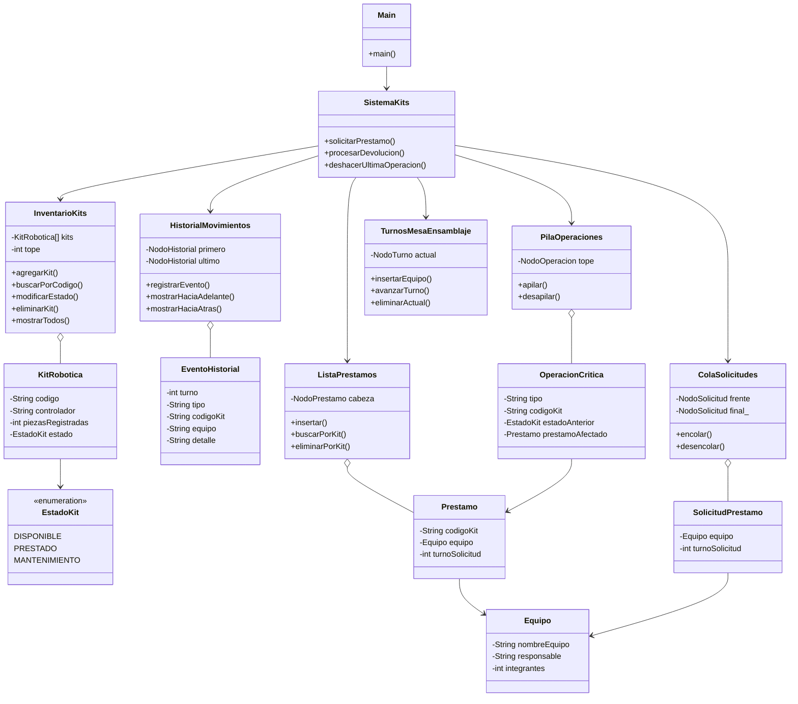

```mermaid
classDiagram
    class EstadoKit {
        <<enumeration>>
        DISPONIBLE
        PRESTADO
        MANTENIMIENTO
    }

    class KitRobotica {
        -String codigo
        -String controlador
        -int piezasRegistradas
        -EstadoKit estado
    }

    class Equipo {
        -String nombreEquipo
        -String responsable
        -int integrantes
    }

    class Prestamo {
        -String codigoKit
        -Equipo equipo
        -int turnoSolicitud
    }

    class SolicitudPrestamo {
        -Equipo equipo
        -int turnoSolicitud
    }

    class EventoHistorial {
        -int turno
        -String tipo
        -String codigoKit
        -String equipo
        -String detalle
    }

    class OperacionCritica {
        -String tipo
        -String codigoKit
        -EstadoKit estadoAnterior
        -Prestamo prestamoAfectado
    }

    class InventarioKits {
        -KitRobotica[] kits
        -int tope
        +agregarKit()
        +buscarPorCodigo()
        +modificarEstado()
        +eliminarKit()
        +mostrarTodos()
    }

    class ListaPrestamos {
        -NodoPrestamo cabeza
        +insertar()
        +buscarPorKit()
        +eliminarPorKit()
    }

    class ColaSolicitudes {
        -NodoSolicitud frente
        -NodoSolicitud final_
        +encolar()
        +desencolar()
    }

    class PilaOperaciones {
        -NodoOperacion tope
        +apilar()
        +desapilar()
    }

    class HistorialMovimientos {
        -NodoHistorial primero
        -NodoHistorial ultimo
        +registrarEvento()
        +mostrarHaciaAdelante()
        +mostrarHaciaAtras()
    }

    class TurnosMesaEnsamblaje {
        -NodoTurno actual
        +insertarEquipo()
        +avanzarTurno()
        +eliminarActual()
    }

    class SistemaKits {
        +solicitarPrestamo()
        +procesarDevolucion()
        +deshacerUltimaOperacion()
    }

    class Main {
        +main()
    }

    KitRobotica --> EstadoKit
    InventarioKits o-- KitRobotica
    ListaPrestamos o-- Prestamo
    Prestamo --> Equipo
    ColaSolicitudes o-- SolicitudPrestamo
    SolicitudPrestamo --> Equipo
    HistorialMovimientos o-- EventoHistorial
    PilaOperaciones o-- OperacionCritica
    OperacionCritica --> Prestamo
    SistemaKits --> InventarioKits
    SistemaKits --> ListaPrestamos
    SistemaKits --> ColaSolicitudes
    SistemaKits --> PilaOperaciones
    SistemaKits --> HistorialMovimientos
    SistemaKits --> TurnosMesaEnsamblaje
    Main --> SistemaKits
```

